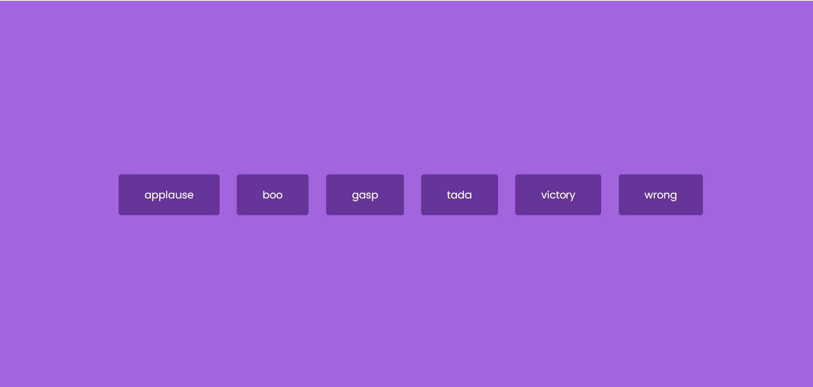

# Sound-Board
Sound-Board has 6 buttons with different sounds for each button. When a button is clicked the sound associated with that clicked button will play however if a second or third button 
is clicked the last clicked sound will play. Sounds will not play over one another.

## Lessons Learned
[Node.appendChild()](https://developer.mozilla.org/en-US/docs/Web/API/Node/appendChild)
 
The .appendChild() adds a new position to a parent element. 

### Website Link
[Sound-Board](https://bhelms2132.github.io/Sound-Board/)

